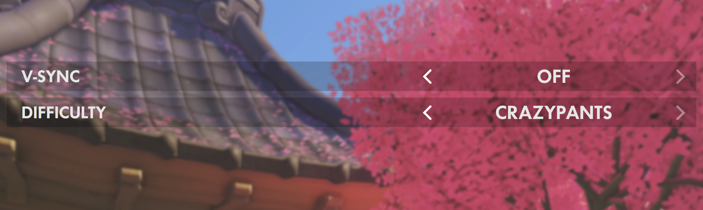

overwatch-settings-stepper
=========

A React component modeling the Overwatch settings stepper UI element

## Install

    npm install overwatch-settings-stepper

### Fonts

#### Futura No 2 D DemiBold

This font is used by Activision Blizzard for much of Overwatch's design. For this component **to match the Overwatch design including the font is required**. It can be licensed from [MyFonts](http://www.myfonts.com/fonts/urw/futura-no-2/futura-no2-d-demi-bold/).

When using CSS font-face, the font-family should match whats below:

    font-family: 'Futura No 2 D DemiBold';

## Usage

Check out example/index.js for exact usage. Below are descriptions.

#### SettingsStepper

The SettingsStepper is the component with the core functionality. It expects `options`, `onStep`, and `activeIndex`.

It is a **controlled** component, meaning when `onStep` is called, a new `activeIndex` is fed to the parent to determine the active visible option of the `options`.
 
#### Toggle

The Toggle is an implementation of SettingsStepper, and a convenience component for those that dont want to implement a simple checkbox/toggle. It expects `toggled` and `onToggle`.

It is a **controlled** component, meaning when `onToggle` is called, a new `toggled` is fed to the parent to determine the On or Off state.

### Import

    import { SettingsStepper, Toggle } from 'overwatch-settings-stepper'

### Props

#### SettingsStepper

| name        | required  | type           | default  | desc 
--- | --- | --- | --- | --- |
| activeIndex | **`X`** | *integer* | 0 | Index of the active visible option, should be stored in parent state and changed from `onStep` |
| onStep | **`X`** | *function* | null | Method called when stepper is progressed (clicked) forward or backward; Parameter is the new `activeIndex` to be set in state in the parent component.  |
| options | **`X`** | *array* | [ 'On', 'Off' ] | array of strings options to step through |
| label | | *string* | | Label for the component, positioned to the left of the stepper options |

#### Toggle

| name        | required  | type           | default  | desc 
--- | --- | --- | --- | --- |
| onToggle | **`X`** | *function* | null | Method called when toggle is toggled (clicked); Parameter is the new `toggled` boolean, to be set in state in the parent component.  |
| toggled | **`X`** | *boolean* | false | Boolean that reflects whether the toggle is On or Off; Should be stored in parent component state, and changed from `onToggle` |
| label | | *string* | | Label for the component, positioned to the left of the toggle options |

## Development

    npm run dev
    
#### Running example

    cd example/; npm run dev
    
Open [http://localhost:8080/](http://localhost:8080/)

### Tests

    npm test
